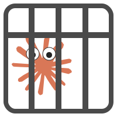

<div id="header" align="center">
    
    <h1>ClaudeCage</h1>
</div>

[](https://github.com/PACHAKUTlQ/ClaudeCage/actions/workflows/build_and_release.yml)

**Run the SOTA AI coding agent in a portable, secure sandbox.**

[Claude Code](https://github.com/anthropics/claude-code) is a state-of-the-art AI coding assistant. Unfortunately, its CLI is distributed as closed-source and obfuscated javascript. You don't know what it's doing. Is it reading your SSH keys? Is it indexing your photos? Is it planning some Skynet world domination from your `~/Downloads` folder?

Probably not... **but why risk it?**

**ClaudeCage** solves this by packaging the `claude-code` CLI into a fully isolated, single-file container. It cannot access any part of your system except for the single project directory you are currently working in.

## Features

- **Secure Sandbox**: Powered by Linux namespaces, the `claude` process is heavily restricted and cannot access your home directory, network information, or other processes.
- **Single-File Portability**: The entire environment—the `claude` binary, the `bun` runtime, and all dependencies—is packed into a single executable file. Download it, make it executable, and run it.
- **No Host Dependencies**: You do not need `node`, `bun`, or anything else installed on your system.
- **Works on Most Linux Distros**: Runs on virtually any modern Linux distribution.
- **Better Performance**: Runs at native speed. It runs even faster than official Claude Code thanks to the modern high performance javascript runtime: [**bun**](https://github.com/oven-sh/bun).
- **Custom API Support**: Easily configure it to use custom API endpoints, including OpenAI proxies.

## How It Works

ClaudeCage is built using the [**RunImage**](https://github.com/VHSgunzo/runimage) project, which leverages [**Bubblewrap**](https://github.com/containers/bubblewrap) to create lightweight, unprivileged containers. This project provides a simple build script to automate the creation of a custom RunImage container specifically for `claude-code`.

## Usage

### 1. Get ClaudeCage

#### Download pre-built binary

Download `ClaudeCage` binary and `ClaudeCage.rcfg` config file, copy both files to a location in your `$PATH`, like `~/.local/bin/`.

#### Build from Source

First, clone the repository. The build script has no dependencies other than `curl` and standard coreutils.

```bash
git clone https://github.com/your-username/ClaudeCage.git
cd ClaudeCage
./build.sh
```

The script will download the necessary components and create two files in the current directory:

- `ClaudeCage`: The portable executable.
- `ClaudeCage.rcfg`: The sandbox configuration file.

### 2. Run ClaudeCage

Move both the `ClaudeCage` executable and the `.rcfg` file to a location in your `$PATH`, like `~/.local/bin/`.

```bash
mv ClaudeCage ClaudeCage.rcfg ~/.local/bin/
```

Now, you can use it just like the regular `claude` command. Navigate to any project directory and run it. It will only have access to that directory.

```bash
cd /path/to/my/awesome-project
ClaudeCage "Refactor this function to be more efficient." # Claude Code now has access to this directory only
```

## Configuration

### Custom API Endpoints & Proxies

You can make `claude-code` use a custom API endpoint (including OpenAI proxies like [claude-code-proxy](https://github.com/fuergaosi233/claude-code-proxy)) by setting environment variables _before_ running ClaudeCage. claude-code-proxy is _NOT_ integrated into this project.

```bash
# Example for using claude-code-proxy that translate API calls to OpenAI API format.
export ANTHROPIC_BASE_URL="http://localhost:8082/"
export ANTHROPIC_AUTH_TOKEN="not-needed-when-using-local-proxy"
export ANTHROPIC_MODEL="anthropic/claude-sonnet-4"
export ANTHROPIC_SMALL_FAST_MODEL="google/gemini-2.0-flash"

ClaudeCage "What is the capital of Nebraska?"
```

See the official [claude-code settings documentation](https://docs.anthropic.com/en/docs/claude-code/settings#environment-variables) for more details.

## Acknowledgements

This project would be impossible without the fantastic work of the following open-source tools:

- [**RunImage**](https://github.com/VHSgunzo/runimage) for making single-file, portable Linux containers a reality.
- [**Bubblewrap**](https://github.com/containers/bubblewrap) for providing the low-level sandboxing technology.
- [**Bun**](https://github.com/oven-sh/bun) as modern, high performance, node.js-compatible javascript runtime.
- [**claude-code-proxy**](https://github.com/fuergaosi233/claude-code-proxy) for recommended OpenAI format API proxy.
